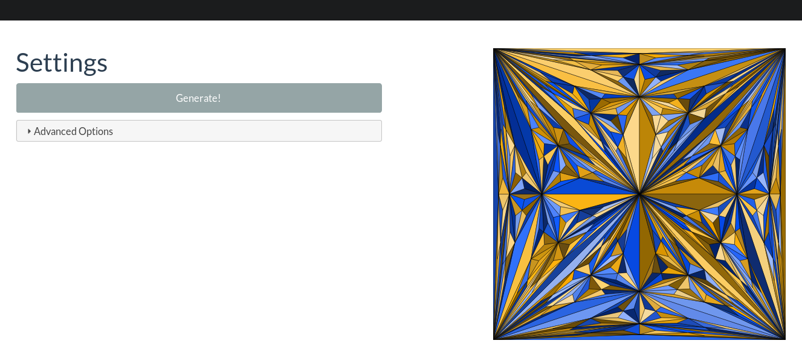

# PolygonArt / TriangleArt Web Service



Web interface for comfortable usage and testing of [my polygon 'art' generator](https://github.com/ahbnr/PolygonArt).
See the generator's GitHub page for further information.

Written in Haskell with the [Yesod framework](https://www.yesodweb.com/).

## Table of Contents
* [TL;DR](#tldr)
* [Prerequisites](#prerequisites)
  * [Installation](#installation)
* [Building](#building)
* [Usage](#usage)

## TL;DR
```console
git clone https://github.com/ahbnr/PolygonArtWeb.git
cd PolygonArtWeb
stack build
xdg-open "http://localhost:3000" && stack exec PolygonArtWeb
```

*Doesn't work?* You **need [stack](#prerequisites)**!

## Prerequisites
You'll need the Haskell development tool [stack](https://haskellstack.org).

### Installation
Follow the official [installation guide](https://docs.haskellstack.org/en/stable/install_and_upgrade/) of stack.
If you're using Arch Linux, the following command should do:

```console
pacman -S stack
```

## Building
```console
stack build
```

Further information on developing with the Yesod Web Framework
can be found [here](http://www.yesodweb.com/).

## Usage
You can run the server like this:
```console
stack exec PolygonArtWeb
```

Now, the web app will be running on http://localhost:3000
